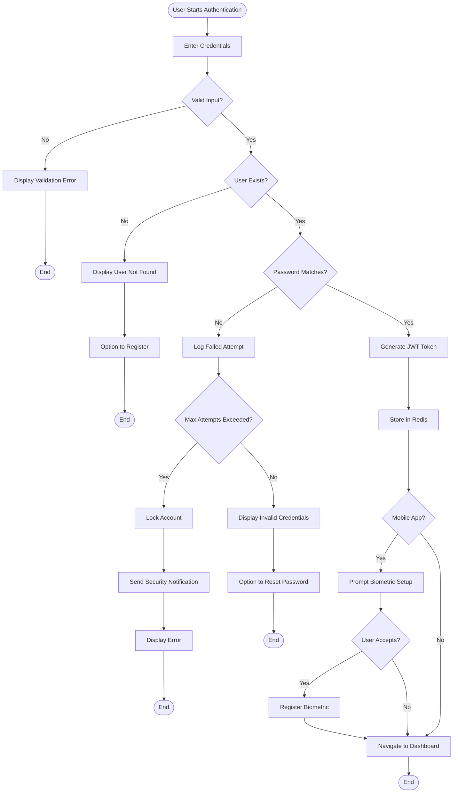
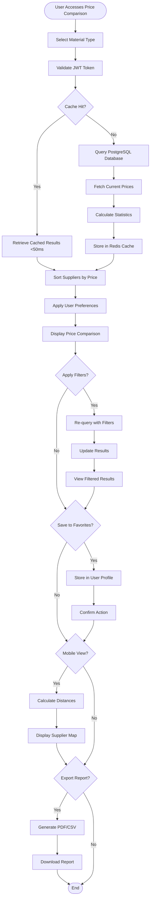
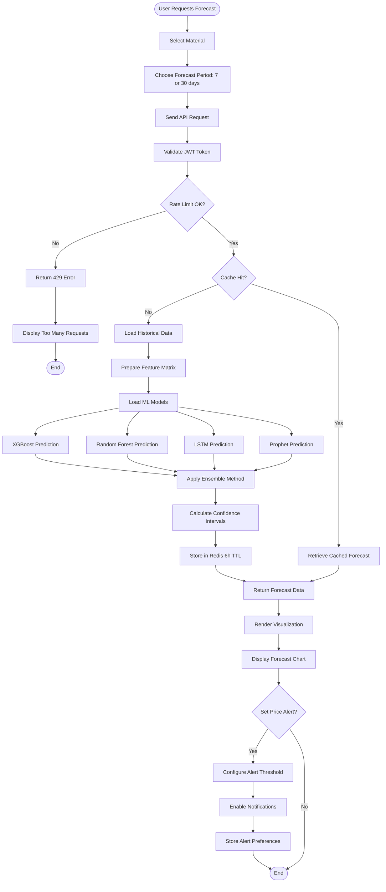
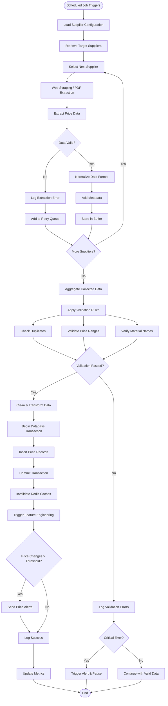
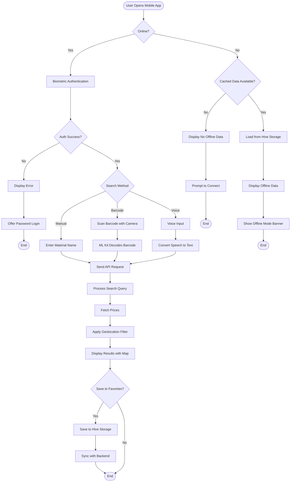
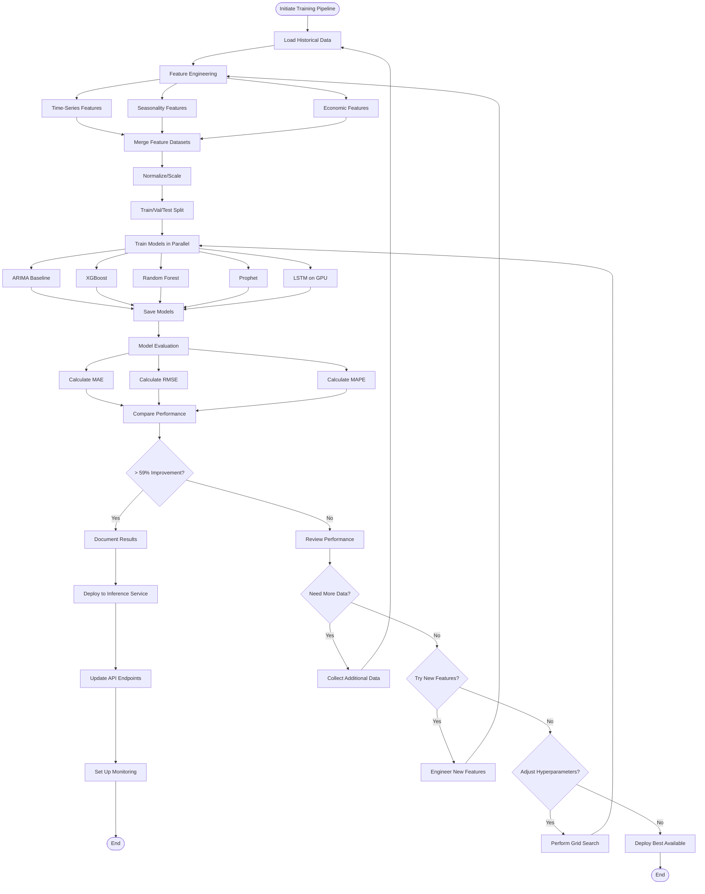

# Activity Diagrams (Mermaid Format)

## 1. User Authentication Flow

## 2. Price Comparison Workflow

## 3. Price Forecasting Workflow

## 4. Data Collection Process

## 5. Mobile App Search (Simplified)

## 6. ML Model Training Process

---

## Viewing These Diagrams

These Mermaid diagrams can be viewed directly on GitHub in markdown files, or using:
- [Mermaid Live Editor](https://mermaid.live/)
- VS Code with Mermaid extension
- Any markdown viewer that supports Mermaid

## Notes

- These simplified versions focus on the main flow
- For detailed swimlane versions with error handling, see the PlantUML files
- Each diagram represents a critical system workflow
- Diagrams are designed to be self-documenting for the development team
