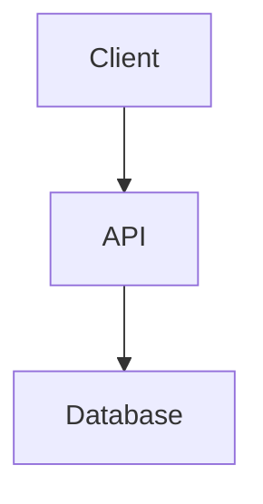

# Architecture Diagrams

This directory contains architecture diagrams for the Building Materials Price Intelligence Platform.

## Diagram Files

### Mermaid Source Files (.mmd)
- `system_architecture.mmd` - System architecture diagram source
- `deployment_architecture.mmd` - Deployment architecture diagram source  
- `data_flow.mmd` - Data flow diagram source

These Mermaid files can be:
1. **Rendered in GitHub** - GitHub automatically renders Mermaid diagrams in markdown
2. **Rendered in VS Code** - Use the "Markdown Preview Mermaid Support" extension
3. **Exported to PNG** - Use Mermaid CLI or online editor

## Viewing Diagrams

### Option 1: GitHub (Recommended)
Simply view the markdown files in GitHub. Mermaid diagrams are automatically rendered.

### Option 2: VS Code
1. Install extension: "Markdown Preview Mermaid Support"
2. Open any `.md` file containing mermaid diagrams
3. Use preview pane (Ctrl+Shift+V or Cmd+Shift+V)

### Option 3: Mermaid Live Editor
1. Visit https://mermaid.live
2. Paste the contents of any `.mmd` file
3. Edit and export as PNG/SVG

## Generating PNG Files

### Using Mermaid CLI

```bash
# Install Mermaid CLI
npm install -g @mermaid-js/mermaid-cli

# Generate PNGs
mmdc -i system_architecture.mmd -o system_architecture.png
mmdc -i deployment_architecture.mmd -o deployment_architecture.png
mmdc -i data_flow.mmd -o data_flow.png
```

### Using Docker

```bash
docker run --rm -v $(pwd):/data minlag/mermaid-cli \
  -i /data/system_architecture.mmd \
  -o /data/system_architecture.png
```

## Embedding in Documentation

To embed these diagrams in markdown files, use:

```markdown

```

Or embed the Mermaid code directly:

````markdown

````

## Diagram Descriptions

### System Architecture
Shows the complete system architecture including:
- Client layer (Web + Mobile)
- API Gateway and Load Balancer
- Backend services
- Caching layer (Redis)
- Database layer (PostgreSQL)
- ML training infrastructure (Kaggle)
- External integrations

### Deployment Architecture  
Shows the production deployment topology:
- Vercel CDN for web frontend
- Fly.io for backend API (Johannesburg)
- Supabase for PostgreSQL
- Redis Cloud for caching
- CI/CD pipeline with GitHub Actions
- Monitoring and logging infrastructure

### Data Flow
Shows key data flow patterns:
1. User authentication flow
2. Price query flow (cache hit)
3. Price query flow (cache miss)
4. ML forecast flow (first request)
5. ML forecast flow (cached)
6. Data collection flow (scraping)
7. Mobile offline synchronization flow

## Maintenance

When updating architecture:
1. Edit the `.mmd` source files
2. Regenerate PNG files if needed
3. Update SYSTEM_ARCHITECTURE.md if changes are significant
4. Commit both source and generated files

---

**Last Updated:** March 9, 2026
