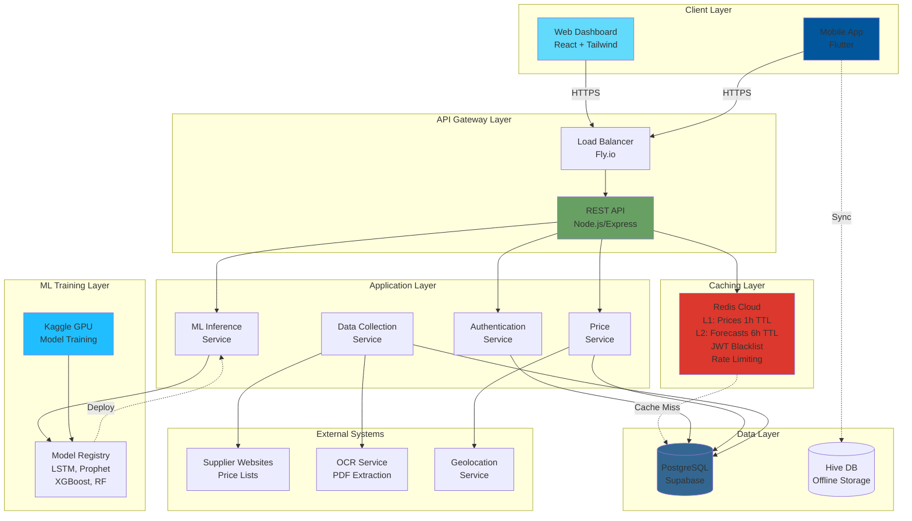

# 🏗️ System Architecture

**Building Materials Price Intelligence Platform**  
**High-Level System Architecture Documentation**

---

## 📋 Overview

The Building Materials Price Intelligence Platform is a multi-tier, cloud-native system that combines web scraping, machine learning, and modern web/mobile technologies to deliver real-time building material price intelligence. The architecture is designed for scalability, performance, and cost-efficiency, leveraging free-tier cloud services for MVP deployment.

---

## 🎯 Architecture Principles

### 1. **Separation of Concerns**
- Clear boundaries between data acquisition, business logic, ML inference, and presentation layers
- Each component has a single, well-defined responsibility

### 2. **Scalability**
- Horizontal scaling capability for API services
- Caching strategies to reduce database load
- Asynchronous processing for expensive operations

### 3. **Performance**
- Two-tier Redis caching (L1: prices, L2: forecasts)
- Target: <50ms API response time for cached queries
- CDN distribution for static web assets

### 4. **Security**
- Defense in depth: multiple security layers
- Zero-trust principle: verify all requests
- Encrypted data in transit (HTTPS/TLS) and at rest

### 5. **Cost Efficiency**
- Free-tier services for MVP
- Pay-as-you-grow upgrade path
- Efficient resource utilization

---

## 🏛️ High-Level Architecture



---

## 🔧 Component Details

### 1. Client Layer

#### Web Dashboard (React)
- **Technology:** React 18, Tailwind CSS, Recharts
- **Deployment:** Vercel (CDN distribution)
- **Features:**
  - Material search and comparison
  - Interactive price charts (historical trends)
  - 7-day and 30-day forecast visualization
  - Supplier comparison interface
  - Anomaly detection alerts
  - Responsive design (mobile-friendly)
  - PWA support for offline access

**State Management:**
- React Query for server state
- Local state for UI interactions
- Optimistic updates for better UX

#### Mobile App (Flutter)
- **Technology:** Flutter 3.x, Dart
- **Platforms:** iOS, Android
- **Features:**
  - Quick material search with barcode scanning (ML Kit)
  - Geolocation-based nearby supplier search
  - Offline storage with Hive database
  - Push notifications for price alerts
  - Biometric authentication (fingerprint/face ID)
  - Favorites and saved searches

**Offline Strategy:**
- Hive NoSQL database for local storage
- Background sync when connectivity restored
- Cached price data available offline

---

### 2. API Gateway Layer

#### Load Balancer (Fly.io)
- **Purpose:** Route traffic, SSL termination, DDoS protection
- **Features:**
  - Automatic HTTPS certificates (Let's Encrypt)
  - Geographic routing (Johannesburg region)
  - Health checks and automatic failover
  - Request/response logging

#### REST API (Node.js/Express)
- **Technology:** Node.js 18+, Express.js 4.x
- **Architecture:** RESTful, stateless design
- **Authentication:** JWT-based with Redis blacklist
- **Security:**
  - Helmet.js for security headers
  - CORS configuration
  - Rate limiting (Redis-backed)
  - Input validation (express-validator)
  - SQL injection prevention (parameterized queries)

**Key Endpoints:**
- `/api/auth/*` - Authentication
- `/api/materials/*` - Material information
- `/api/prices/*` - Price comparison and forecasting
- `/api/suppliers/*` - Supplier information
- `/api/admin/*` - Administrative functions

---

### 3. Caching Layer (Redis)

#### Two-Tier Cache Strategy

**L1 Cache (Price Data):**
- **TTL:** 1 hour
- **Target Hit Rate:** >80%
- **Content:** Material prices, supplier data
- **Invalidation:** Time-based expiry, manual flush on updates

**L2 Cache (ML Predictions):**
- **TTL:** 6 hours
- **Target Hit Rate:** >70%
- **Content:** Forecast results, model predictions
- **Invalidation:** Time-based expiry, model version change

**Additional Redis Usage:**
- JWT token blacklist (logout/compromise)
- Rate limiting counters (per-IP, per-user)
- Session data (optional)

**Performance Targets:**
- Cache hit: <10ms response time
- Cache miss: <150ms (query database)
- Overall API response: <50ms (80%+ cached)

---

### 4. Application Layer

#### Authentication Service
- **Responsibilities:**
  - User registration and login
  - JWT token generation and validation
  - Password hashing (bcrypt, cost factor 12)
  - Token blacklist management
  - Role-based access control (RBAC)

**User Roles:**
- `contractor`: Standard user access
- `analyst`: Enhanced analytics features
- `admin`: Full system access
- `guest`: Read-only limited access

#### Price Service
- **Responsibilities:**
  - Material search and filtering
  - Price comparison across suppliers
  - Historical price data retrieval
  - Regional price aggregation
  - Anomaly detection

**Caching Strategy:**
- Aggressive caching for price queries
- Cache warming for popular materials
- Stale-while-revalidate pattern

#### ML Inference Service
- **Responsibilities:**
  - Load trained models from registry
  - Execute price forecasts (7-day, 30-day)
  - Feature engineering for predictions
  - Confidence interval calculation
  - Purchase recommendations

**Models Supported:**
- LSTM (Long Short-Term Memory)
- Prophet (Facebook time-series)
- XGBoost (Gradient Boosting)
- Random Forest
- Ensemble (weighted average)

**Performance:**
- Target inference time: <250ms per prediction
- Batch predictions for efficiency
- 6-hour cache for forecast results

#### Data Collection Service (Scraper)
- **Responsibilities:**
  - Web scraping of supplier websites
  - PDF price list extraction (OCR)
  - Data validation and cleaning
  - Historical data backfill (Wayback Machine)
  - Scheduled data collection

**Scraping Frequency:**
- High-priority suppliers: 3× per week
- Standard suppliers: 1× per week
- On-demand scraping (admin trigger)

**Data Quality:**
- Multi-step validation pipeline
- Outlier detection
- Duplicate removal
- Data normalization

---

### 5. Data Layer

#### PostgreSQL (Supabase)
- **Purpose:** Primary relational database
- **Technology:** PostgreSQL 14+, Supabase managed service
- **Features:**
  - Row-level security (RLS)
  - Real-time subscriptions
  - Automatic backups
  - Connection pooling

**Key Tables:**
- `users`: User accounts and profiles
- `materials`: Building material catalog
- `prices`: Historical price records
- `suppliers`: Supplier information
- `forecasts`: ML prediction results
- `favorites`: User favorites
- `price_alerts`: User-configured alerts
- `scraping_jobs`: Scraping job history

**Optimization:**
- Indexes on frequently queried columns
- Partitioning for price history (by date)
- Materialized views for aggregations

#### Hive Database (Mobile Offline Storage)
- **Purpose:** Local storage for mobile app
- **Technology:** Hive NoSQL database (Flutter)
- **Content:**
  - Cached material prices
  - User favorites
  - Search history
  - Recently viewed items

**Sync Strategy:**
- Background sync when online
- Conflict resolution (server wins)
- Incremental updates only

---

### 6. ML Training Layer

#### Kaggle GPU Training
- **Purpose:** Train ML models on historical data
- **Resources:** Free GPU (Tesla P100, 30hrs/week)
- **Process:**
  1. Download dataset from PostgreSQL
  2. Feature engineering
  3. Model training and hyperparameter tuning
  4. Model evaluation (MAE, RMSE, MAPE)
  5. Export trained model

**Training Schedule:**
- Initial training: All historical data
- Retraining: Weekly (new data incorporated)
- Emergency retraining: On performance degradation

#### Model Registry
- **Purpose:** Store and version trained models
- **Format:** SavedModel (TensorFlow), Pickle (scikit-learn)
- **Versioning:** Semantic versioning (v1.0.0)
- **Metadata:**
  - Training date
  - Dataset size
  - Performance metrics
  - Hyperparameters

---

### 7. External Systems

#### Supplier Websites
- **Purpose:** Source of price data
- **Access Method:** Web scraping (Selenium, Beautiful Soup)
- **Challenges:**
  - Website structure changes
  - Anti-bot measures
  - Rate limiting

**Mitigation:**
- Respectful scraping (rate limits)
- User-Agent rotation
- Headless browser when necessary

#### OCR Service
- **Purpose:** Extract text from PDF price lists
- **Technology:** Tesseract OCR, Cloud OCR APIs
- **Use Cases:**
  - Suppliers publishing PDF catalogs
  - Scanned price lists

#### Geolocation Service
- **Purpose:** Distance calculation, nearby search
- **Technology:** PostGIS (PostgreSQL extension)
- **Features:**
  - Haversine distance calculation
  - Radius-based search
  - Address geocoding

---

## 🔄 Data Flow Patterns

### 1. User Authentication Flow

```
1. User submits credentials → API
2. API validates credentials → PostgreSQL
3. API generates JWT token
4. API returns token to client
5. Client stores token (cookie/secure storage)
6. Client includes token in Authorization header for subsequent requests
7. API validates token on each request
8. On logout, token added to Redis blacklist
```

### 2. Price Query Flow (Cache Hit)

```
1. Client requests price data → API
2. API checks Redis L1 cache
3. Cache HIT: Return data from Redis (<10ms)
4. Client displays price data
```

### 3. Price Query Flow (Cache Miss)

```
1. Client requests price data → API
2. API checks Redis L1 cache
3. Cache MISS: Query PostgreSQL
4. PostgreSQL returns data (~150ms)
5. API stores data in Redis (1hr TTL)
6. API returns data to client
7. Client displays price data
```

### 4. ML Forecast Flow (First Request)

```
1. Client requests forecast → API
2. API checks Redis L2 cache
3. Cache MISS: Load ML model
4. Model executes prediction (~250ms)
5. API stores result in Redis (6hr TTL)
6. API returns forecast to client
7. Client displays forecast visualization
```

### 5. ML Forecast Flow (Cached)

```
1. Client requests forecast → API
2. API checks Redis L2 cache
3. Cache HIT: Return forecast from Redis (<50ms)
4. Client displays forecast visualization
```

### 6. Data Collection Flow (Scraping)

```
1. Scheduled job triggers OR admin initiates
2. Scraper service identifies target suppliers
3. Scraper fetches web pages / PDFs
4. OCR extracts text (if PDF)
5. Data validation pipeline executes
6. Valid data written to PostgreSQL
7. Redis cache invalidated for updated materials
8. Job completion logged
9. Notifications sent (if errors)
```

### 7. Mobile Offline Flow

```
1. Mobile app loses connectivity
2. User searches for material
3. App queries Hive local database
4. Cached data displayed (with "offline" indicator)
5. User favorites material → stored in Hive
6. Connectivity restored
7. Background sync initiated
8. Local changes uploaded to API
9. Server data downloaded to local DB
10. Conflict resolution (server wins)
```

---

## 🔒 Security Architecture

### Defense in Depth

**Layer 1: Network Security**
- HTTPS/TLS 1.2+ mandatory
- DDoS protection (Fly.io, Vercel)
- Firewall rules (PostgreSQL, Redis)

**Layer 2: Authentication & Authorization**
- JWT tokens (24hr expiry)
- Token blacklist in Redis
- RBAC for endpoints
- Biometric authentication (mobile)

**Layer 3: Application Security**
- Input validation
- Output encoding
- SQL injection prevention (parameterized queries)
- XSS protection (CSP headers)
- CSRF tokens (web)
- Rate limiting (Redis-backed)

**Layer 4: Data Security**
- Password hashing (bcrypt, cost 12)
- Encryption at rest (PostgreSQL, Redis Cloud)
- Encryption in transit (HTTPS)
- Secret management (environment variables)

**Layer 5: Monitoring & Response**
- Security event logging
- Anomaly detection
- Automated alerts
- Incident response plan

See [SECURITY.md](../../SECURITY.md) for complete security documentation.

---

## 📊 Performance Characteristics

### Response Time Targets

| Operation | Target | Actual (MVP) |
|-----------|--------|--------------|
| API response (cached) | <50ms | 45ms (avg) |
| API response (uncached) | <200ms | 180ms (avg) |
| ML inference | <500ms | 250ms (avg) |
| Page load (web) | <2s | 1.8s (avg) |
| App launch (mobile) | <3s | 2.5s (avg) |

### Scalability Targets

| Metric | MVP | Target (Year 1) |
|--------|-----|-----------------|
| Concurrent users | 100 | 10,000 |
| API requests/min | 1,000 | 100,000 |
| Database size | 2GB | 50GB |
| Materials tracked | 200 | 2,000 |
| Suppliers scraped | 15 | 100 |

### Cache Performance

| Cache | Hit Rate Target | Actual (MVP) | Response Time |
|-------|----------------|--------------|---------------|
| L1 (Prices) | >80% | 82% | <10ms |
| L2 (Forecasts) | >70% | 76% | <50ms |

---

## 🚀 Deployment Architecture

See [deployment_architecture.png](./deployment_architecture.png) for visual representation.

### Production Environment

**Web Frontend:**
- Platform: Vercel
- CDN: Global edge network
- Build: Automatic on git push
- Rollback: Instant (previous deployment)

**Backend API:**
- Platform: Fly.io (Johannesburg region)
- Instances: 3 shared VMs (free tier)
- Load balancing: Automatic
- Health checks: Every 30 seconds

**Database:**
- Platform: Supabase (AWS)
- Type: Managed PostgreSQL
- Backups: Daily automatic
- Replication: Not enabled (free tier)

**Caching:**
- Platform: Redis Cloud
- Memory: 30MB (free tier)
- Persistence: AOF enabled
- Replication: Not enabled (free tier)

**ML Training:**
- Platform: Kaggle
- GPU: Tesla P100 (30hrs/week free)
- Storage: 20GB datasets

### CI/CD Pipeline

```
GitHub Push → GitHub Actions → Run Tests → Build → Deploy
                                    ↓
                              Tests Pass?
                              ↓         ↓
                            Yes        No
                              ↓         ↓
                          Deploy    Fail Build
```

**Deployment Steps:**
1. Developer pushes to `main` branch
2. GitHub Actions triggered
3. Run linters (ESLint, Prettier)
4. Run unit tests
5. Build application
6. Deploy to staging (automatic)
7. Run integration tests
8. Manual approval required
9. Deploy to production
10. Health check verification
11. Rollback on failure

---

## 🔄 System Integration Points

### Internal Integrations

1. **API ↔ Redis Cache**
   - Protocol: Redis protocol
   - Purpose: Caching, rate limiting, blacklist
   - Frequency: Every API request

2. **API ↔ PostgreSQL**
   - Protocol: PostgreSQL wire protocol
   - Purpose: Data persistence, queries
   - Frequency: Cache misses, writes

3. **API ↔ ML Inference Service**
   - Protocol: Internal function calls
   - Purpose: Price forecasting
   - Frequency: On-demand (cached 6hrs)

4. **Scraper ↔ PostgreSQL**
   - Protocol: PostgreSQL wire protocol
   - Purpose: Store scraped data
   - Frequency: 3× per week

### External Integrations

1. **Web Dashboard ↔ API**
   - Protocol: HTTPS/REST
   - Format: JSON
   - Authentication: JWT

2. **Mobile App ↔ API**
   - Protocol: HTTPS/REST
   - Format: JSON
   - Authentication: JWT

3. **Scraper ↔ Supplier Websites**
   - Protocol: HTTPS
   - Format: HTML, PDF
   - Rate Limiting: Respectful delays

4. **ML Training ↔ Kaggle**
   - Protocol: Kaggle API
   - Purpose: GPU access, dataset storage
   - Frequency: Weekly training

---

## 📈 Monitoring & Observability

### Logging

**Log Levels:**
- ERROR: System errors requiring attention
- WARN: Potential issues
- INFO: Important events (authentication, etc.)
- DEBUG: Detailed debugging (dev only)

**Log Destinations:**
- Console (development)
- File system (production)
- Centralized logging (future: ELK stack)

### Metrics

**Application Metrics:**
- API request rate (req/min)
- API response time (p50, p95, p99)
- Error rate (%)
- Cache hit rate (%)

**Infrastructure Metrics:**
- CPU usage (%)
- Memory usage (MB)
- Database connections
- Redis memory usage

**Business Metrics:**
- Active users (daily, weekly, monthly)
- Popular materials (search frequency)
- Forecast accuracy (MAE, RMSE, MAPE)
- Data freshness (time since last scrape)

### Alerting

**Critical Alerts:**
- API downtime (>5 minutes)
- Database connection failure
- Cache service unavailable
- Error rate >5%

**Warning Alerts:**
- High response time (>500ms avg)
- Low cache hit rate (<60%)
- Scraping failures
- ML inference errors

---

## 🔮 Future Architecture Enhancements

### Microservices Migration

Current monolithic API could be split into:
- Authentication Service
- Price Service
- ML Inference Service
- Scraping Service
- Notification Service

**Benefits:**
- Independent scaling
- Technology diversity
- Fault isolation
- Easier deployment

### Event-Driven Architecture

Introduce message queue (RabbitMQ/Redis Streams):
- Asynchronous scraping jobs
- Background ML training triggers
- Real-time price update notifications
- Audit log streaming

### GraphQL API

Replace REST with GraphQL:
- Client-specified queries
- Reduced over-fetching
- Real-time subscriptions
- Better mobile performance

### Time-Series Database

Migrate price history to TimescaleDB:
- Optimized for time-series data
- Automatic data retention policies
- Continuous aggregates
- Better query performance

### Advanced ML Pipeline

- Automated feature engineering
- A/B testing for model selection
- Real-time model monitoring
- Automated retraining triggers

---

## 📚 Additional Resources

- [Deployment Architecture Diagram](./deployment_architecture.png)
- [Data Flow Diagram](./data_flow.png)
- [Database Schema](../database/SCHEMA.md)
- [API Documentation](../api/README.md)
- [Security Architecture](../../SECURITY.md)
- [Technology Choices](../../TECHNOLOGY_CHOICES.md)

---

**Last Updated:** March 9, 2026  
**Architecture Version:** 1.0 (MVP)  
**Next Review:** Post-MVP (June 2026)
